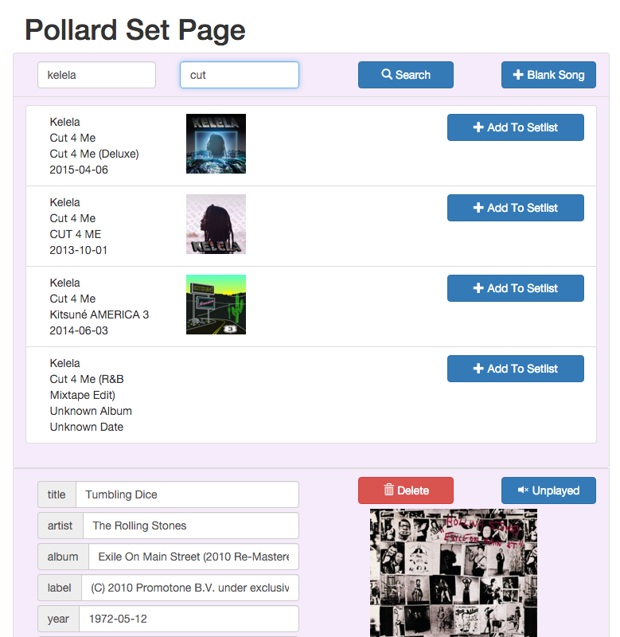
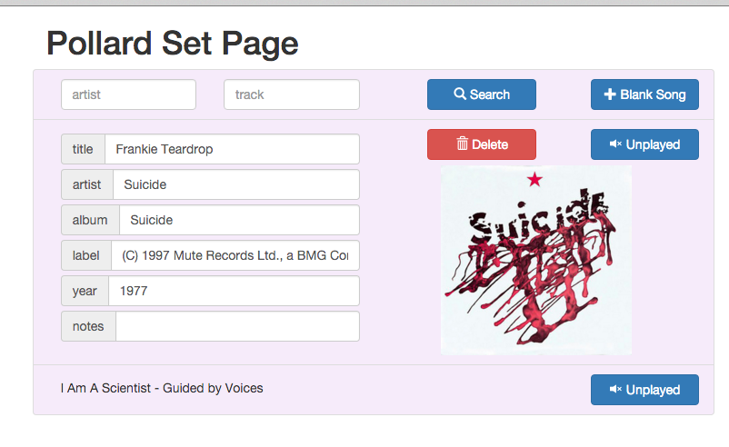

# POLLARD

A DJ Playlist creator

## Features
- Add songs to a set
	- search by title and artist
	- inputs for artist, title, album, label, year, dj comments
	- find API || (use dataset && (run SQL || search index server))
- Mark songs as 'live/currently playing'

## Methodology
- Reactiflux to stand-up prototype for early UX feedback w/o building persistence layer
- Bootstrap for UI styling cuz: ez

## Work In Progress Stills

*SEARCH*

*SETPAGE*

*MOBILE SEARCH*

*MOBILE SETPAGE*

## DIY

[Dev Notes][devnotes]

### Frontend 
-`cp secrets-template.js secrets.js`
&& then enter in yr [echonest][echonestapikey]
&& [7digital][7digitalapikey] api keys

-`cp pollard-template.config.js pollard.config.js`
&&  fill in yr config details

- `npm install && npm start`
&& then [in yo bowser](http://0.0.0.0:3000)

### Backend
- `cp sprout/sprout-template.config.json sprout/sprout.config.json`
&&  fill in yr config details

- `cd sprout && npm install && DEBUG=sprout npm start` 
- OR `node debug ./bin/www` 
&& then [in yo bowser](http://0.0.0.0:3420)

## BIG UPZ
Boilerplate from [React Redux Boilerplate][rrbp]

### KICKSMAN
[MAS FLAIR](gifs)

[rrbp]: https://github.com/knowbody/react-redux-boilerplate.git
[devnotes]: txt/devnotes.md
[echonestapikey]: https://developer.echonest.com/account/register
[7digitalapikey]: https://api-signup.7digital.com/
