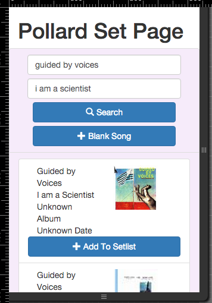

# POLLARD

A DJ Playlist creator

## Stills

*SEARCH*

*SETPAGE*

*MOBILE SEARCH*

*MOBILE SETPAGE*

## DIY

[Dev Notes][devnotes]

## env

- `cp env/development.env.template env/development.env`
  && then enter in yr [echonest][echonestapikey]
  && [7digital][7digitalapikey] api keys

## buildin

- `./pollard/bin/build_dist.sh [development, staging, production]`
- `./bin/docker_build.sh`

## runnin

- `./bin/docker_run_containers.sh [development, staging, production]`

## releasin (WIPAF)

- ./release/mk_releases.sh

## devin

with sprout && mongo containers running:

- `cd pollard && npm start`
- in yr browser at 0.0.0.0:3000

This runs webpack-dev-server, w/ hot reloading && other goodies. Strickly for dev purposes.

### KICKSMAN
[MAS FLAIR](gifs)

### SPIRITUAL SUPPORTERS

1. [Trenton Strong](https://github.com/trentonstrong)
2. [Billiam Gatez](https://www.microsoft.com)

[devnotes]: txt/devnotes.md
[echonestapikey]: https://developer.echonest.com/account/register
[7digitalapikey]: https://api-signup.7digital.com/
