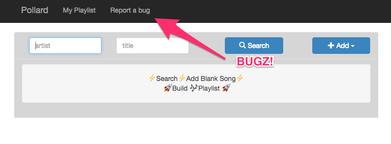

# DJ Testing

## Thanks!
- Testing the Playlist App is a big job, so thank you for your help!
- If it breaks, don't worry! Click that big 'Report a Bug' button && let us know what happened.

- If it breaks real bad && you can't enter your playlist, don't worry! Click that big 'Report a Bug' button && use a paper playlist.

## Step 0: Before your show
- TEST: Check the [schedule](http://www.freeformportland.org/schedule).
  Is your timeslot right? If not, send an email to editor@freeformportland.org
- TEST: can you login to [WordPress](http://www.freeformportland.org/wp-admin)?
  If not, send an email to editor@freeformportland.org

## Step 1: Find your show page
- Login to WordPress
- Click 'Shows'

- Hover over your show && click 'View'

## Step 2: Make new playlist
- Click 'Make New Playlist'

- Will open up new Playlist App tab in your browser

## Step 3: Add Songs
- Enter an artist && title && press Enter or click 'Search'
- If you find results, click 'Add To Setlist'

- If no results, you can try refining your search

- You can add a blank song by clicking 'Add' -> 'Blank Song'

- When you're back-announcing, you can 'Add' -> 'Air Break'

- If you add songs out of order, you can drag && drop them into place.

## Step 4: Playing songs
- When you play a song, click 'Play Song'.
- This updates the Now Playing feature on freeformportland.org && records the start time of the track.

- As you play more songs, the currently playing song will display 'Now Playing'.

- TEST: is the Now Playing feature on your WordPress Show page displaying the currently playing song? If not, that's a bug!

## Step 5: Editing songs
- Click on the 'Title - Artist' line of a song to open Edit Mode.
- Edit any field && your changes are automatically saved.
- To delete an entry, click the Trash Can icon. It will prompt you to confirm.

